#  Memo Memo — Translation Memory Editor

> **A fully client-side, browser-based editor for Translation Memory files.** No server. No installation. Your data never leaves your machine.

Memo Memo is a professional tool designed for translators, localization engineers, and language service providers who need a fast, lightweight way to inspect, clean, search, edit, merge, and align bilingual translation assets — directly in the browser.

---

## ✨ Features

| Feature | Details |
|---|---|
| **Multi-format support** | TMX 1.4, XLIFF / XLF / SDLXLIFF, CSV (comma, semicolon, tab-separated) |
| **Search & Filter** | Full-text search with regex support · Source-only, target-only, or both scopes |
| **In-table Editing** | Click any segment to edit source or target text inline |
| **Statistics Panel** | Word counts, segment counts, average segment length — updated live |
| **Metadata Editor** | Edit TMX header fields: author, tool, version, languages, date, data type, segment type |
| **TM Merger** | Combine multiple TMs (any supported format) into a single TMX, with optional deduplication |
| **Alignment Module** | Auto-align two plain-text documents (`.txt`, `.docx`, `.pptx`) into bilingual segments |
| **Session Persistence** | Full session auto-saved to IndexedDB; restored automatically on next visit |
| **Export** | Download edited TM as a clean TMX 1.4 file; aligned pairs export as TMX, CSV or TXT |
| **Keyboard Shortcuts** | `Alt+S` to focus search · `PageUp/PageDown` to paginate · `Arrow keys` to navigate rows |
| **100% Client-Side** | Zero backend, zero file upload to any server — privacy by design |

---

## 🗺️ Architecture & Data Flow

```mermaid
%%{init: {'theme': 'base', 'themeVariables': {'primaryColor': '#FFFFFF', 'primaryBorderColor': '#93C5FD', 'primaryTextColor': '#1F2937', 'lineColor': '#93C5FD', 'secondaryColor': '#F0F9FF', 'tertiaryColor': '#F0F9FF', 'background': '#F0F9FF', 'nodeBorder': '#93C5FD', 'clusterBkg': '#F0F9FF', 'clusterBorder': '#93C5FD', 'edgeLabelBackground': '#F0F9FF', 'fontFamily': 'Inter, sans-serif'}}}%%

flowchart TD
    subgraph INPUT["📂  File Input Layer"]
        direction TB
        A1["🖱️ File Picker\n(click or drag & drop)"]
        A2["📄 File types:\nTMX · XLIFF · XLF\nSDLXLIFF · CSV"]
        A1 --> A2
    end

    subgraph VALIDATION["🔍  Validation & Pre-check"]
        direction TB
        B1["Extension check\n(whitelist)"]
        B2["Size guard\n(≤ 20 MB)"]
        B3["XML pre-validation\n(DOMParser + parsererror)"]
        B4["CSV delimiter\ndetection"]
        B1 --> B2 --> B3
        B2 --> B4
    end

    subgraph PARSERS["⚙️  parsers.js — Format Parsers"]
        direction LR
        C1["parseTMXContent()\nExtracts header metadata\n+ all &lt;tu&gt; / &lt;tuv&gt; / &lt;seg&gt; elements"]
        C2["parseXLIFFContent()\nHandles trans-unit, unit,\nsegment, mrk elements"]
        C3["parseCSVContent()\nAuto-detects delimiter\nReads header row for lang codes"]
        C4["parseFileContent()\nRouter by file extension"]
        C4 --> C1
        C4 --> C2
        C4 --> C3
    end

    subgraph STATE["🧠  state.js — Shared Application State"]
        direction TB
        S1["tmxData\n{ units[ ], sourceLanguage,\ntargetLanguage, metadata }"]
        S2["filteredUnits[ ]\n(active search results)"]
        S3["mergeFiles[ ]\n(queued TMs for merge)"]
        S4["metaEditorData\n{ units[ ], metadata }"]
        S5["alignedPairs[ ]\n(aligned sentence pairs)"]
        S6["currentPage\nitemsPerPage: 30"]
    end

    subgraph PERSIST["💾  db.js — Session Persistence"]
        direction LR
        D1["IndexedDB\n(MemoMemo_DB)\ntmxData · mergeFiles\nmetaEditorData · alignedPairs"]
        D2["localStorage\nsearchQuery · filters\nactiveTab · pagination\nmerge config · filenames"]
    end

    subgraph TABS["🖥️  Four-Tab UI (components/)"]
        direction TB

        subgraph TAB_SEARCH["🔎  searchTab.js — Search & View"]
            T1A["Search input\n+ Regex toggle"]
            T1B["Scope buttons\n(Both / Source / Target)"]
            T1C["Paginated results table\n(30 rows/page)\n→ Inline cell editing"]
            T1D["Statistics panel\n(word & segment counts)"]
            T1A --> T1B --> T1C
        end

        subgraph TAB_META["✏️  metaTab.js — Metadata Editor"]
            T2A["File drop zone"]
            T2B["Header field form\n(author, tool, version,\ndates, lang codes,\ndata type, seg type)"]
            T2C["Export TMX button"]
            T2A --> T2B --> T2C
        end

        subgraph TAB_MERGE["🔀  mergeTab.js — Merge TMs"]
            T3A["Multi-file drop zone"]
            T3B["Ordered file list\n(drag to reorder)"]
            T3C["Merge options\n(lang codes, author,\ntool, deduplication)"]
            T3D["Execute Merge\n→ Download TMX"]
            T3A --> T3B --> T3C --> T3D
        end

        subgraph TAB_ALIGN["⚖️  alignTab.js — Alignment"]
            T4A["Source text input\n(.txt / .docx / .pptx)"]
            T4B["Target text input\n(.txt / .docx / .pptx)"]
            T4C["alignTexts()\nsplitIntoSentences()\n(abbreviation-aware)"]
            T4D["Preview table\n(merge / shift / delete rows)"]
            T4E["Export: TMX · CSV · TXT\nor inject into Search tab"]
            T4A --> T4C
            T4B --> T4C
            T4C --> T4D --> T4E
        end
    end

    subgraph EXPORT["📤  exporter.js — TMX Generator"]
        E1["generateTMXXML()\nBuilds TMX 1.4 compliant XML\nwith escapeXml() sanitization"]
        E2["Blob → createObjectURL\n→ &lt;a download&gt; click"]
        E1 --> E2
    end

    subgraph ALIGNER["🔤  aligner.js — Text Extraction"]
        AL1["extractTextFromDocx()\nJSZip → word/document.xml\n→ w:p / w:t nodes"]
        AL2["extractTextFromPptx()\nJSZip → ppt/slides/*.xml\n→ a:t nodes"]
    end

    %% === Main flow ===
    A2 -->|"FileReader.readAsText()"| VALIDATION
    VALIDATION -->|"valid"| PARSERS
    PARSERS -->|"{ units, sourceLanguage,\ntargetLanguage, metadata }"| STATE

    STATE -->|"idbSet()"| PERSIST
    PERSIST -->|"idbGet() on page load\n(session restore)"| STATE

    STATE --> TAB_SEARCH
    STATE --> TAB_META
    STATE --> TAB_MERGE
    STATE --> TAB_ALIGN

    T1C -->|"unit.target edited"| STATE
    T2B -->|"metadata fields updated"| STATE

    TAB_SEARCH -->|"Download TMX"| EXPORT
    TAB_META -->|"Export with new metadata"| EXPORT
    TAB_MERGE -->|"Merge & deduplicate units"| EXPORT
    TAB_ALIGN -->|"Export aligned pairs"| EXPORT

    T4A -->|"file.arrayBuffer()"| ALIGNER
    T4B -->|"file.arrayBuffer()"| ALIGNER
    ALIGNER --> T4C

    style INPUT fill:#F0F9FF,stroke:#93C5FD,color:#1F2937
    style VALIDATION fill:#F0F9FF,stroke:#93C5FD,color:#1F2937
    style PARSERS fill:#F0F9FF,stroke:#93C5FD,color:#1F2937
    style STATE fill:#F0F9FF,stroke:#93C5FD,color:#1F2937
    style PERSIST fill:#F0F9FF,stroke:#93C5FD,color:#1F2937
    style TABS fill:#F0F9FF,stroke:#93C5FD,color:#1F2937
    style TAB_SEARCH fill:#F0F9FF,stroke:#93C5FD,color:#1F2937
    style TAB_META fill:#F0F9FF,stroke:#93C5FD,color:#1F2937
    style TAB_MERGE fill:#F0F9FF,stroke:#93C5FD,color:#1F2937
    style TAB_ALIGN fill:#F0F9FF,stroke:#93C5FD,color:#1F2937
    style EXPORT fill:#F0F9FF,stroke:#93C5FD,color:#1F2937
    style ALIGNER fill:#F0F9FF,stroke:#93C5FD,color:#1F2937

    style A1 fill:#3B82F6,stroke:#3B82F6,color:#FFFFFF
    style C4 fill:#3B82F6,stroke:#3B82F6,color:#FFFFFF
    style T1C fill:#3B82F6,stroke:#3B82F6,color:#FFFFFF
    style T3D fill:#3B82F6,stroke:#3B82F6,color:#FFFFFF
    style T4C fill:#3B82F6,stroke:#3B82F6,color:#FFFFFF
    style E2 fill:#3B82F6,stroke:#3B82F6,color:#FFFFFF
    style D1 fill:#FFFFFF,stroke:#93C5FD,color:#1F2937
    style D2 fill:#FFFFFF,stroke:#93C5FD,color:#1F2937
```



---

## 🏗️ Module Breakdown

```
Memomemo-main/
├── index.html                  # Shell: tab navigation, CDN scripts (Tailwind CSS, JSZip)
└── js/
    ├── state.js                # Singleton shared state object (tmxData, filteredUnits, mergeFiles…)
    ├── db.js                   # Persistence layer: IndexedDB (heavy data) + localStorage (prefs)
    ├── parsers.js              # Format parsers: parseTMXContent · parseXLIFFContent · parseCSVContent
    ├── exporter.js             # TMX 1.4 XML builder + XML character escaping
    ├── aligner.js              # Sentence splitter · DOCX/PPTX text extractor (via JSZip)
    ├── ui.js                   # DOM element registry (els) + rendering helpers (updateResults, renderStats…)
    ├── main.js                 # App orchestrator: init · event wiring · session restore · tab switching
    └── components/
        ├── searchTab.js        # HTML template: file drop zone, search bar, results table, stats panel
        ├── metaTab.js          # HTML template: metadata form fields, export button
        ├── mergeTab.js         # HTML template: multi-file list, merge options form
        └── alignTab.js         # HTML template: dual text inputs, alignment preview table
```

---

## 🚀 Getting Started

Memo Memo is a **static web application** — no build step, no server, no dependencies to install.

### Option A — Open directly in the browser

```bash
# Clone or download the repository
git clone https://github.com/your-username/memomemo.git

# Open the app
# Double-click index.html  — or —
start index.html          # Windows
open index.html           # macOS
xdg-open index.html       # Linux
```

> **Note:** Some browsers restrict ES Module imports from `file://` URIs. If the app does not load, use Option B.

### Option B — Serve with any static file server (recommended)

```bash
# Using Node.js (npx, no install needed)
npx serve .

# Using Python 3
python -m http.server 8080

# Using VS Code
# Install the "Live Server" extension and click "Go Live"
```

Then navigate to `http://localhost:8080` (or whichever port your server reports).

### Option C — GitHub Pages / Netlify / Vercel

Drop the repository into any static hosting provider. No configuration needed — just point the publish directory to the repository root.

---

## 📖 Usage Guide

### 1 · Search & View
1. Drag-and-drop or click to upload a **TMX, XLIFF, XLF, SDLXLIFF, or CSV** file.
2. Type in the search bar to filter segments in real time (supports **regex**).
3. Use the **Both / Source / Target** scope buttons to narrow your search.
4. Click any cell in the results table to **edit it inline**.
5. Click **Download Updated TMX** to export the modified memory.

### 2 · Edit Metadata
1. Load a TM file in the **Edit Metadata** tab (or use the file already loaded in Search & View — both tabs share the same data).
2. Update any header field: author, tool version, creation date, language codes, data type, segment type.
3. Click **Export TMX** to download the file with the new metadata.

### 3 · Merge TMs
1. Switch to the **Merge TMs** tab.
2. Upload two or more TM files (any supported format, in any combination).
3. Reorder the files with the up/down arrows to control merge priority.
4. Set the output language codes, author, tool name, and optionally enable **Remove Duplicates**.
5. Click **Merge & Download** to generate the combined `merged_translation_memory.tmx`.

### 4 · Align Translations
1. Switch to the **Align Translations** tab.
2. Load or paste the **source-language** document (`.txt`, `.docx`, `.pptx`, or plain text).
3. Load or paste the **target-language** document.
4. Click **Start Alignment** — the engine splits both texts into sentences and pairs them positionally.
5. Review the preview table: **Merge** two consecutive rows, **Shift** a misaligned target, or **Delete** a row.
6. Click **Open in MemoMemo** to load the aligned pairs directly into the Search & View tab, or export as **TMX / CSV / TXT**.

---

## 🔒 Privacy

All file processing happens **entirely inside your browser**. No file content, no translation data, and no metadata is ever sent to a remote server. Your files stay on your machine.

---

## 🛠️ Tech Stack

| Layer | Technology |
|---|---|
| UI framework | [Tailwind CSS](https://tailwindcss.com/) via CDN |
| DOCX/PPTX extraction | [JSZip 3.10](https://stuk.github.io/jszip/) via CDN |
| Module system | Native ES Modules (`type="module"`) |
| Persistence | IndexedDB + localStorage (no cookies, no external storage) |
| XML parsing | Browser-native `DOMParser` |
| Build tools | **None** — zero-build, zero-dependency project |

---

## 📄 License

This project is licensed under the **GNU General Public License v3.0**. See [LICENSE](LICENSE) for full terms.

---

<p align="center">
  Made with ♥ by <a href="https://www.linkedin.com/in/gsaguma" target="_blank">Gabriel Saguma</a>
</p>
